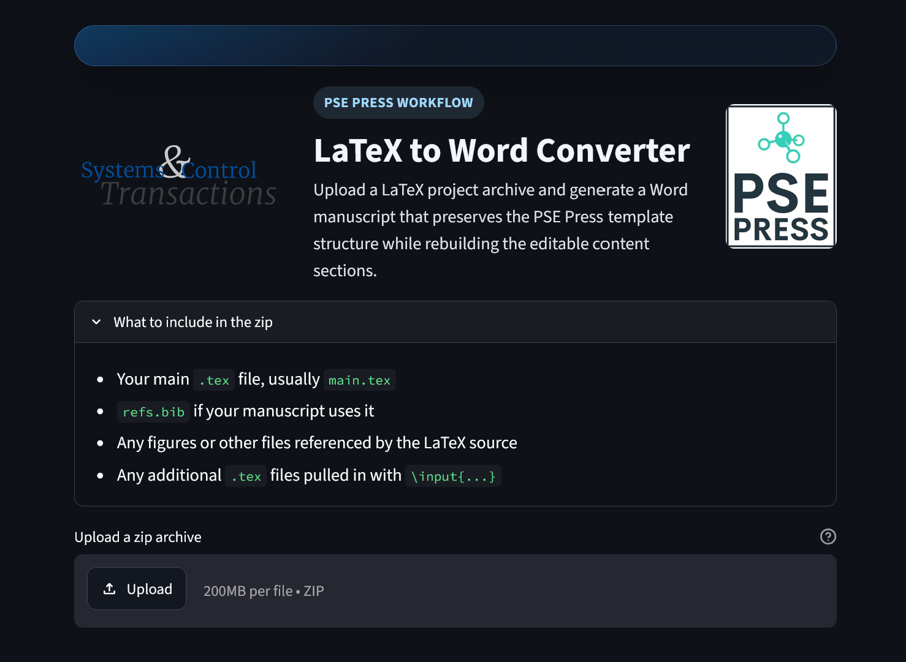

# Streamlit LaTeX-to-Word Converter

This folder is a self-contained Streamlit app for converting a zipped LaTeX manuscript into a Word document using the bundled `template.docx` and the existing template-aware converter.

## Hosted app

The app is also available online through Streamlit Community Cloud:

[psepress.streamlit.app](https://psepress.streamlit.app)

Anyone can use the hosted app to upload a zipped LaTeX archive and convert it into a Word document without running the project locally.



## Files

- `app.py`: Streamlit UI
- `latex_to_word.py`: shared converter logic used by both the Streamlit app and the offline batch tools
- `batch_convert_archives.py`: offline batch converter for folders of submission zip archives
- `convert_submissions.ps1`: Windows PowerShell wrapper for offline batch conversion
- `convert_submissions.sh`: Linux bash wrapper for offline batch conversion
- `template.docx`: Word template reused for styling and layout
- `requirements.txt`: Python dependencies for local runs or Streamlit Community Cloud

## Local run

```powershell
cd .\psepress
python -m pip install -r requirements.txt
streamlit run app.py
```

## Offline batch conversion

This directory is self-contained for both hosted and offline use. The batch tools here use the same local `latex_to_word.py` and `template.docx` as the web app.

Python entry point:

```powershell
cd .\psepress
python .\batch_convert_archives.py --input-dir .\submissions\input --output-dir .\submissions\output
```

Windows PowerShell wrapper:

```powershell
cd .\psepress
powershell -ExecutionPolicy Bypass -File .\convert_submissions.ps1 -InputDir .\submissions\input -OutputDir .\submissions\output
```

Linux bash wrapper:

```bash
cd ./psepress
./convert_submissions.sh ./submissions/input ./submissions/output
```

The batch run writes one `.docx` per input archive and a `conversion-report.csv` summary in the output folder.

## Deploy on Streamlit Community Cloud

1. Put the contents of this folder into a GitHub repository, or make this folder the root of a new repo.
2. In Streamlit Community Cloud, create a new app from that repo.
3. Set the main file path to `app.py`.

## Upload format

Upload a `.zip` archive that includes:

- your manuscript entry file, typically `main.tex`
- `refs.bib` if the manuscript uses it
- figures and any other referenced files
- any additional `.tex` files included with `\input{...}`

Keep the same relative paths your manuscript expects.

## Notes

- The app does not compile LaTeX; it parses the manuscript source and rebuilds a `.docx` using `template.docx`.
- The converter is template-aware for this project rather than a general LaTeX-to-Word engine.
- For best results, upload the same project structure you use locally.
